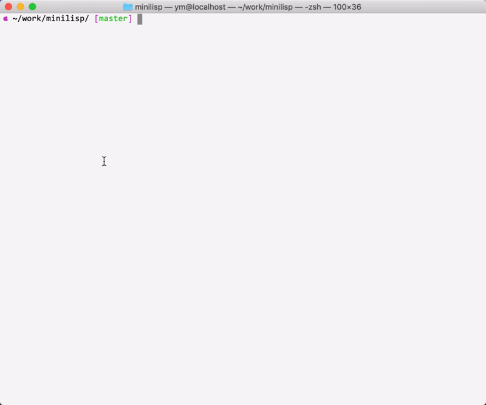

## MiniLisp背景 ##

写一个主流语言的编译器非常困难，仅仅前端Parser的工作量就很大。直到看到
这个项目[rui314/minilisp](https://github.com/rui314/minilisp) 。

用Java实现一个这样的Lisp解释器应该很有趣。

## 功能 ##

目前的版本包含了如下特性，

- 整数

```
(+ 1 2) ;; -> 3
```

- cell的操作，如：cons，car，cdr

cons组成一个cell

```
(define pair (cons 'a 'b))
(println pair) ;; -> (a . b)
(println (car pair)) ;; -> a
(println (cdr pair)) ;; -> b
```

- 基本的函数，如：+，-，if, while, setq


```
(if (= 1 1) 
   (println 'yes)
   (println 'no)) ;; -> yes
   
(define i 0)
(define array ())
(while (<= i 3)
   (setq array (cons i array))
   (setq i (+ i 1)))
(println array)  ;; -> (3 2 1 0)
```

- 自定义函数

用defun关键字定义函数
```
(defun add (x y)
   (+ x y)) 
(println (add 1 2)) ;; -> 3 
```

可以进行参数的匹配，因为 `(1 2) <=> (1 . (2))`, 所以当形参是 (x . y) 的时候，
x 为 1，y 为 (2)。

```
(defun list (x . y)
    (println x)
    (println y)
    (cons x y)) 

(define arr (list 1 2))
;;x -> 1
;;y -> (2)
(println arr) ;; -> (1 2)

```
在看一个例子

```
(defun match ( x . ( y z ))
   (println x)
   (println y)
   (println z))
(match 1 2 3)
;; x -> 1
;; y -> 2
;; z -> 3
```

- 闭包

每次执行都有结果返回，但是默认不打印。所以需要调用println来对返回的结果进行打印。

```
;; A countup function. We use lambda to introduce local variables because we
;; do not have "let" and the like.
(define counter
  ((lambda (count)
     (lambda ()
       (setq count (+ count 1))
       count))  ;;
   0))

(println (counter))  ; -> 1
(println (counter))  ; -> 2

;; This will not return 12345 but 3. Variable "count" in counter function
;; is resolved based on its lexical context rather than dynamic context.
(println ((lambda (count) (counter)) 12345))  ; -> 3
```

- 宏

unless是一个宏。list是一个工具函数，会生成一个list expression。macroexpand是一个函数实现对宏的扩展。

```
(defun list (x . y)
  (cons x y))
  
(defmacro unless (condition expr)
  (list 'if condition () expr))
  
(define x 0)
(println (unless (= x 0) '(x is not 0)))  ; -> ()
(println (unless (= x 1) '(x is not 1)))  ; -> (x is not 1)

(println (macroexpand '(unless (= x 1) '(x is not 1))))
;; -> (if (= x 1) () '(x is not 1))
```

## 运行 ##

该项目是基于Java8和maven的，所以环境要首先支持。

### 编译打包 ###
 
进入项目根目录，运行如下命令

```
 ~/work/minilisp/$ ./bin/package.sh 
[INFO] Scanning for projects...
[INFO] 
[INFO] ----------------------< com.threelambda:minilisp >----------------------
[INFO] Building minilisp 1.0-SNAPSHOT
[INFO] --------------------------------[ jar ]---------------------------------
......
......

```

### 执行hello.sh ###

```
 ~/work/minilisp/$ ./bin/hello.sh                     
(hello word)
```

### REPL方式运行 ###

```
 ~/work/minilisp/$ ./bin/run.sh 
  (println 'hello)
 hello
```

### 执行文件 ###

nqueens.lisp来自于[rui314/minilisp](https://github.com/rui314/minilisp/blob/master/examples/nqueens.lisp) 。
但是我修改了几个地方，因为实现的有点不同。以下是4皇后的解法。


```
 ~/work/minilisp/$ ./bin/run.sh < examples/nqeens.lisp
start
(x @ x x)
(x x x @)
(@ x x x)
(x x @ x)
$
(x x @ x)
(@ x x x)
(x x x @)
(x @ x x)
$
done
```

### 演示 ###




